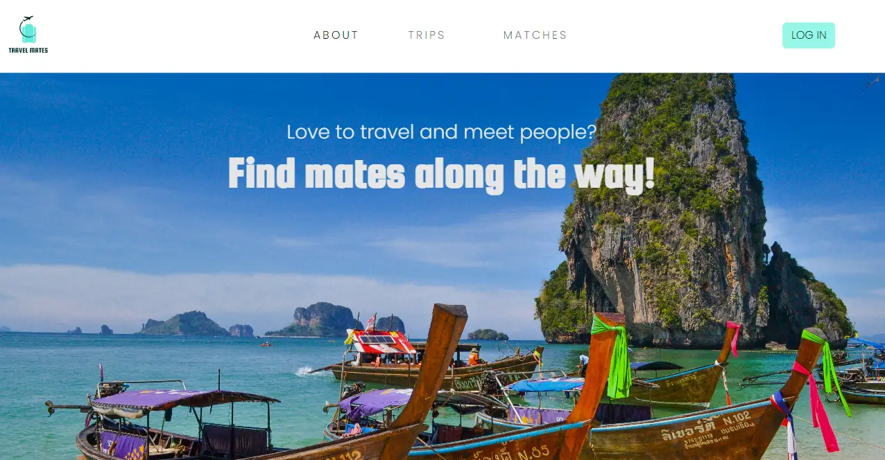

<!-- PROJECT LOGO -->
<p align="center">
  
</p>
<div align="center">
  <h1>Travel Mates</h1>
  <p>

This project is an innovative web app designed to revolutionize solo traveling and trip planning! Our platform matches you with individuals who share your interests and destinations, making solo adventures a thing of the past. Seamlessly connect with like-minded travelers and streamline your itinerary with interactive maps and customizable calendars. Join us today and unlock endless possibilities for adventure and connection!
</p>
</div>

<!-- TABLE OF CONTENTS -->
<details>
  <summary>Table of Contents</summary>
  <ol>
    <li>
      <a href="#about-the-project">About The Project</a>
      <ul>
        <li><a href="#key-features">Key Features</a></li>
        <li><a href="#built-with">Built With</a></li>
      </ul>
    </li>
    <li>
      <a href="#getting-started">Getting Started</a>
      <ul>
        <li><a href="#installation">Installation</a></li>
        <li><a href="#development- server">Development server</a></li>
      </ul>
    </li>
    <li>
      <a href="#roadmap">Roadmap</a>
    </li>
    <li>
      <a href="#contact">Contact</a>
    </li>
  </ol>
</details>

<!-- ABOUT THE PROJECT -->
## About The Project
<p align="center">
  
</p>

Travel Mates is a web application that enables users to create an account, log their trips and match with users who are going on to the same destination as them on overlapping dates, showing their match percentage based on the sightseeing spots they both want to visit.

### Key Features

#### User & Trip Management
- **User**: Create, update, delete, and view profiles.
- **Trip and Sight**: Create, update, delete, and view details.

#### Session Management & Permissions
- **JWT Tokens and HttpOnly cookies**: Secure user authentication and authorization.
- **Permission Control**: Manage access to specific features and areas.

#### Map & Calendar Views
- **Map View**: See your trip and sightseeing spots on an interactive map.
- **Calendar View**: Stay organized with a personalized trip calendar.

<p align="right">(<a href="#readme-top">back to top</a>)</p>

### Built With

#### Front End
* [![Angular][Angular.io]][Angular-url]
* [![Bootstrap][Bootstrap.com]][Bootstrap-url]

#### Back End
* [![JWT][JWT.io]][JWT-url]
* [![Node.js][Node.js.io]][Node.js-url]
* [![Express][Express.io]][Express-url]
* [![Sequelize][Sequelize.io]][Sequelize-url]
* [![mySQL][mySQL.io]][mySQL-url]


<p align="right">(<a href="#readme-top">back to top</a>)</p>

<!-- GETTING STARTED -->
## Getting Started

### Installation


#### Front End

1. Clone the repo
   ```sh
   git clone https://github.com/laradelrio/FrontEndTravelPlanner.git
   ```
2. Install NPM packages
   ```sh
   npm install
   ```
3. Create a .env file
4. Add your the following to the .env file:
   ```sh
   imgbbApiKey= your_imgbb_api_key
    unsplashClientID= your_unsplash_client_id
    mapBoxApiKey= your_mapbox_api_key
   ```

#### Back End

1. Clone the repo
   ```sh
   git clone https://github.com/laradelrio/BackEndTravelPlanner.git
   ```
2. Install NPM packages
   ```sh
   npm install
   ```
3. Create a .env file in the root directory 
4. Add the database and token secret information:
   ```sh
    DATABASE_HOST = localhost
    DATABASE_USER = root
    DATABASE_PASSWORD = your_password
    DATABASE = travel_planner

    TOKEN_SECRET = your_token_secret

    NODE_ENV = production

    SENDGRID_API_KEY= your_sendgird_api_key
    SENDER_EMAIL = your_email
  
   ```

### Development server

#### Front End
1. Run
   ```sh
   npm start
   ```
 2. Navigate to `http://localhost:4200/`. The application will automatically reload if you change any of the source files.

#### Back End
1. Start Apache and MySQL in XAMPP
2. Run
   ```sh
   nodemon server.js
   ```

#### MySQL
1. Create the data base using the nodejs_events.sql file in the Back End

<!-- ROADMAP -->
## Roadmap

- [X] User account creation and management (update account data, change password and delete account).
- [X] Trip and sight creation, display, edit, and deletion.
- [X] Map showcasing trip location and sights.
- [X] Calendar displaying trip details.
- [X] User match percentage display.
- [X] User-friendly interface for trip management.
- [ ] Implement user chat.

<p align="right">(<a href="#readme-top">back to top</a>)</p>

<!-- CONTACT -->
## Contact

Lara Del Rio Garcia - lara.delrio333@gmail.com

Project Link: 
- Front End: [https://github.com/laradelrio/FrontEndTravelPlanner.git](https://github.com/laradelrio/FrontEndTravelPlanner.git)
- Back End: [https://github.com/laradelrio/BackEndTravelPlanner.git](https://github.com/laradelrio/BackEndTravelPlanner.git) 

<p align="right">(<a href="#readme-top">back to top</a>)</p>

<!-- MARKDOWN LINKS & IMAGES -->
<!-- https://www.markdownguide.org/basic-syntax/#reference-style-links -->
[linkedin-shield]: https://img.shields.io/badge/-LinkedIn-black.svg?style=for-the-badge&logo=linkedin&colorB=555
[linkedin-url]: www.linkedin.com/in/lara-del-rio-garcia
[product-screenshot]: images/screenshot.png
[Angular.io]: https://img.shields.io/badge/Angular-DD0031?style=for-the-badge&logo=angular&logoColor=white
[Angular-url]: https://angular.io/
[Bootstrap.com]: https://img.shields.io/badge/Bootstrap-563D7C?style=for-the-badge&logo=bootstrap&logoColor=white
[Bootstrap-url]: https://getbootstrap.com
[Express.io]: https://img.shields.io/badge/express.js-%23404d59.svg?style=for-the-badge&logo=express&logoColor=%2361DAFB
[Express-url]: https://expressjs.com/
[Node.js.io]: https://img.shields.io/badge/node.js-6DA55F?style=for-the-badge&logo=node.js&logoColor=white
[Node.js-url]: https://nodejs.org/en
[MySQL.io]: https://img.shields.io/badge/mysql-%2300f.svg?style=for-the-badge&logo=mysql&logoColor=white
[mySQL-url]: https://www.mysql.com/
[Nodemon.io]: https://img.shields.io/badge/NODEMON-%23323330.svg?style=for-the-badge&logo=nodemon&logoColor=%BBDEAD
[Nodemon-url]:https://www.npmjs.com/package/nodemon
[JWT.io]: https://img.shields.io/badge/JWT-black?style=for-the-badge&logo=JSON%20web%20tokens
[JWT-url]: https://jwt.io/
[Sequelize.io]: https://img.shields.io/badge/-Sequelize-52B0E7?style=flat-square&logo=sequelize&labelColor=52B0E7&logoColor=FFF
[Sequelize-url]: https://sequelize.org/